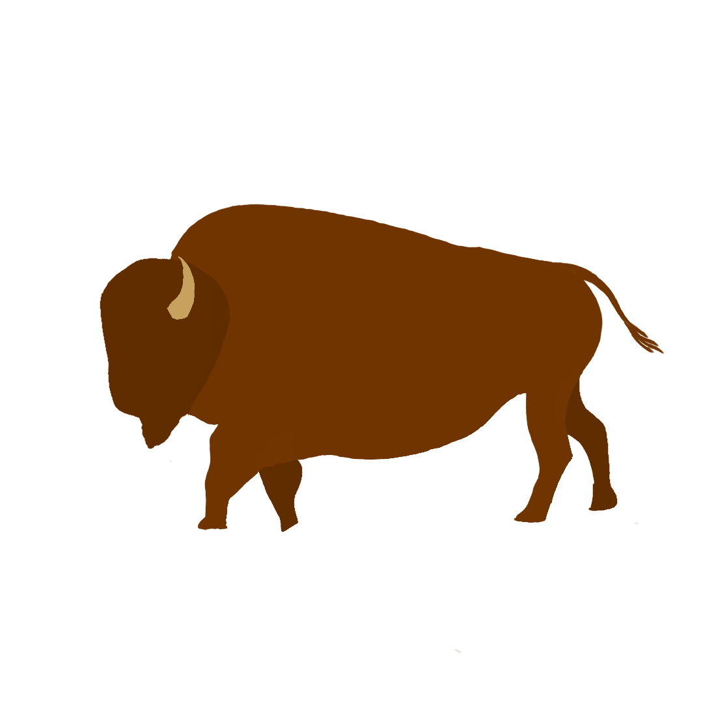
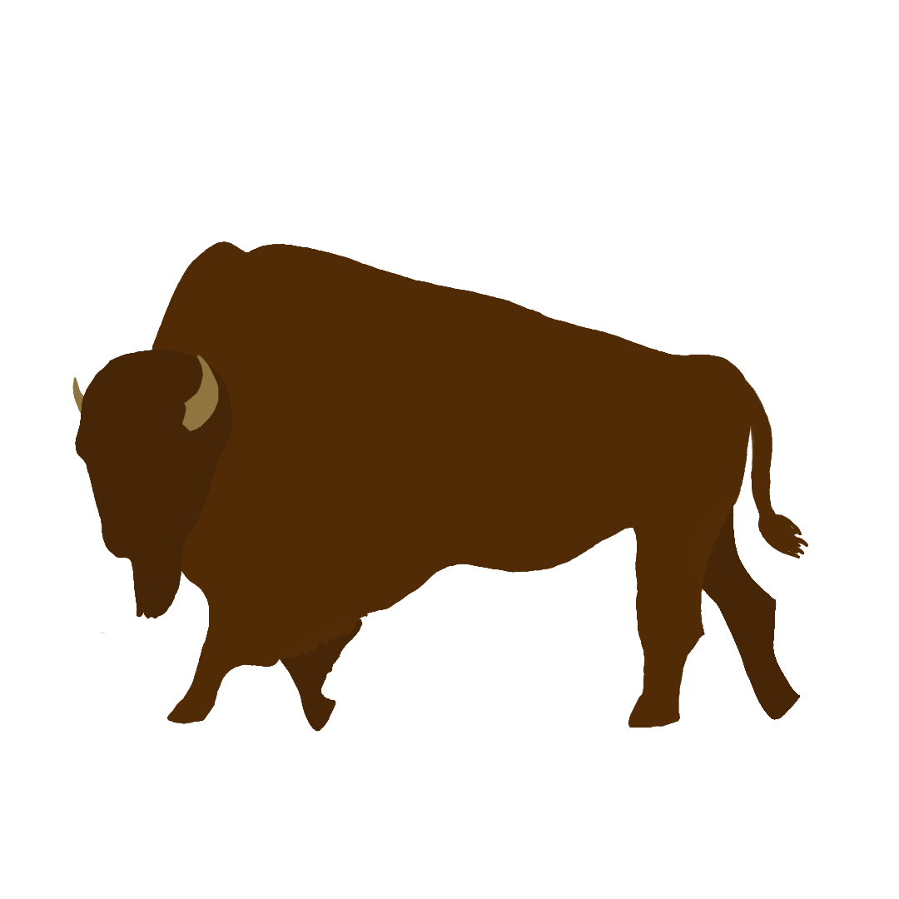
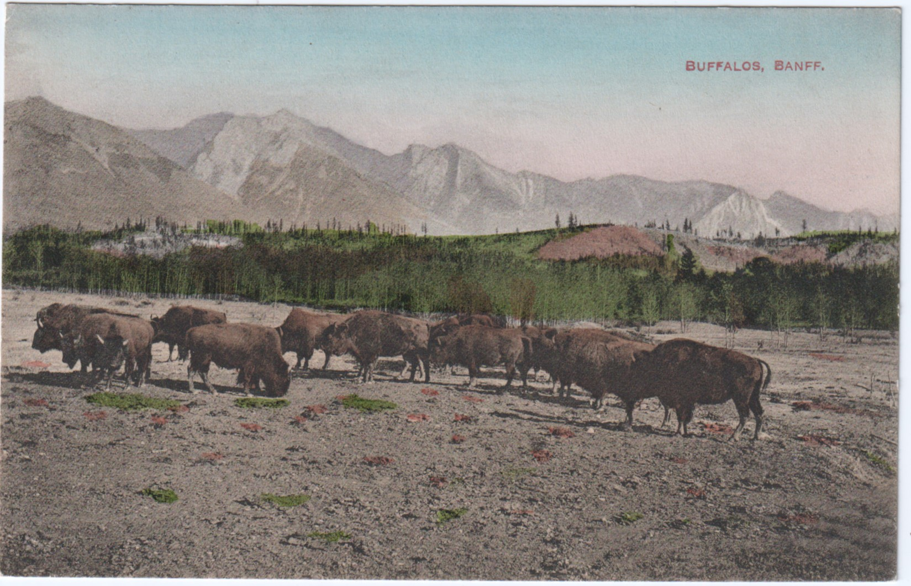
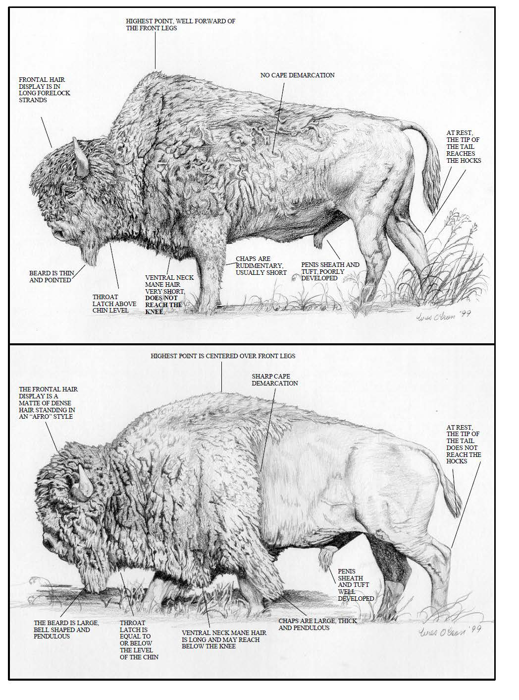
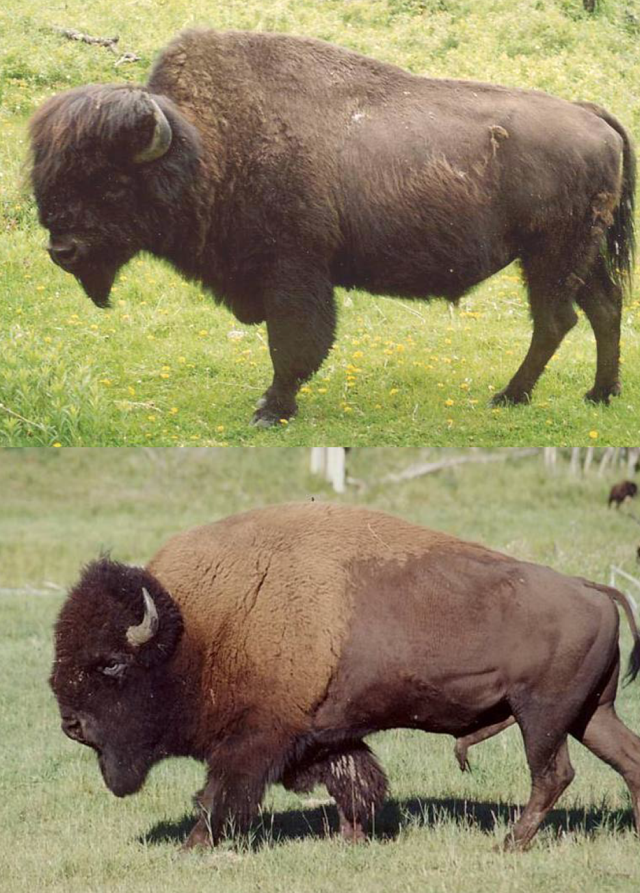
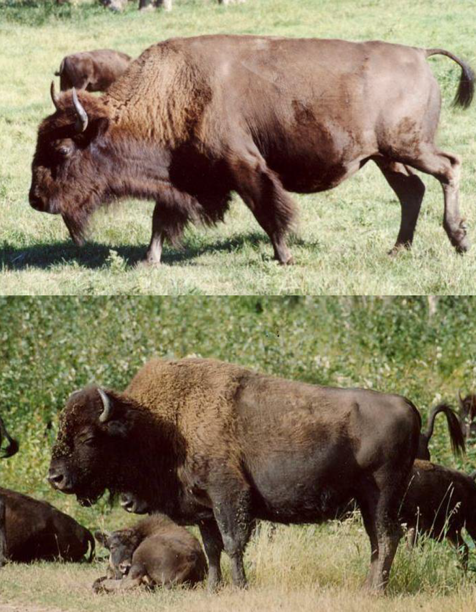
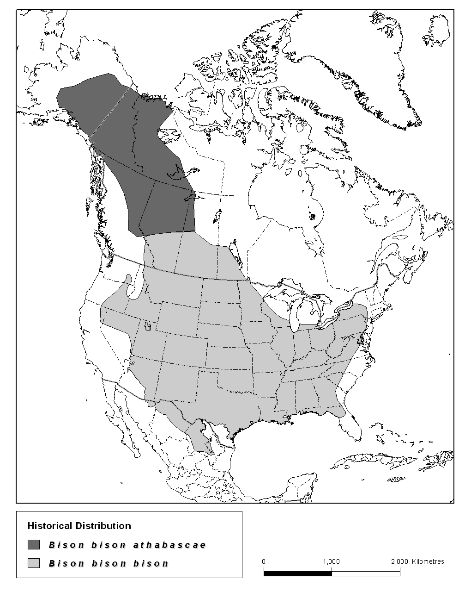
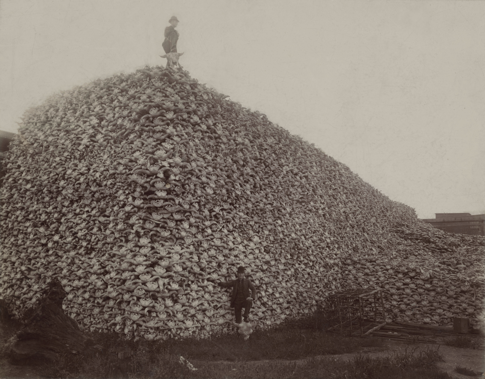
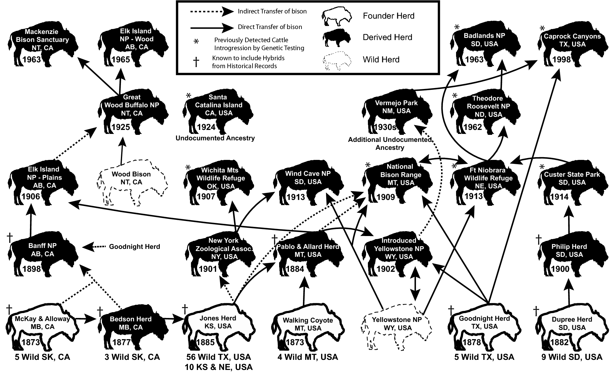
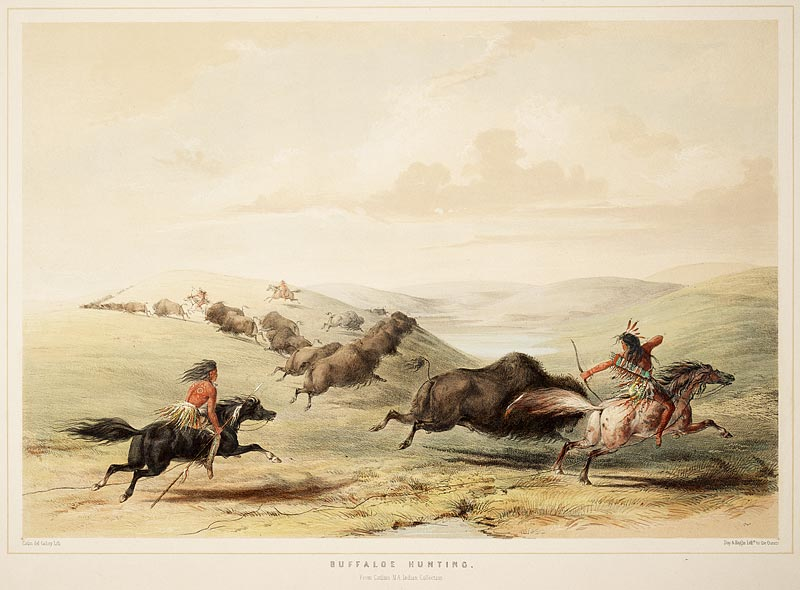

```{r setup, include=FALSE}
knitr::opts_chunk$set(echo = TRUE)
```

<header>
<div class="wrap">
<a id="home"></a> </br> <!-- navigation header -->

<div style="position: fixed; right: 10px; top: 100px;">
  
</div>

<div style="position: fixed; left: 10px; bottom: 50px; transform: scaleX(-1)">
  
</div>

</br>

<center>

<div style="text-align: right;">
<p>[CC BY 2.0 Jason Woodhead](https://www.flickr.com/photos/80365963@N00/54034074226)</p>
<div></br>

</br>

<div style="text-align: center;">
 
  \
<span style="text-align: center;">
<center> <h1>
**Buffalo, ** \
**Iinnii, Tatanga, Tatanka, Paskwâwimostos, Xaniti, ** \
**Qwisp, Kamquq̓ukuǂ ʔiyamu, Iyanee’, heneeceeno',ésevone,** \
**Mushkode Bizhikim, Q’weyqway, Hii3einoon, boyzhan, ʔíítaanɔ́ɔ́nʔi,**\
**Bison** \
<h1> <center>
</span>
 
 
</div> </br>


<span> 
<center> **‘Buffalo’ is a species of cultural significance and non-human relative to many Indigenous Nations. It is capitalized to represent its status and imporatance.** </center> \
<center> *"We see Buffalo and many of our four-legged relatives as equals."* -Remington Bracher </center> 
</span></br>


<div style="text-align: justify;">
I offer this positionality statement as a recognition of my lived experiences, responsibilities, background knowledge, and cultural grounding that shape my approach to this research. I am a Nêhiyaw (Cree) member of the Muskoday First Nation (MFN). On my mother's side of the family comes from MFN through her late father, Lloyd Bear, and her late mother, Eileen Spence, from Nisichawayasihk Cree Nation (formerly known as Nelson House First Nation), while my father's side comes from a mixed European heritage. I am also a land user who has spent the better part of the last 29 years hunting, fishing, and trapping all over western Canada. My upbringing was guided by my father's passion for the outdoors, which instilled in me a profound respect for the land and water along with the fish and wildlife that call it home. My relationship with the natural world is not just an academic endeavour but a deeply personal and spiritual journey that has shaped my life and identity from a young age. I was raised in a household where hunting, fishing, and trapping were not only sustenance-based activities but also acts of cultural preservation. Through these experiences, I have seen Bison not only as an ecological and cultural keystone species but also as a relative whose presence is intertwined with Indigenous identities across Turtle Island. - Remington Bracher
<div></br>

**Is it Buffalo or Bison?**

Bison are commonly known as Buffalo. Bison and Buffalo are the same animal. The words are often used interchangeably. You can say Buffalo is the common name and Bison is the scientific name (*Bison bison*). Buffalo are the largest land mammal found in North America. There are two types of Buffalo in Canada, the Wood Buffalo and the Plains Buffalo. 

</br>

**Wood Buffalo vs Plains Buffalo**

Currently, **Wood Buffalo** (*Bison bison bison*) is listed as Threatened and classified as 'wildlife' only in British Columbia, Alberta, Manitoba, and the Northwest Territories. Meanwhile, **Plains Buffalo** (*Bison bison athabascae*) is listed as 'Special Concern' and are not protected under the Species at Risk Act (SARA) in Canada. They are only classified as 'wildlife' in British Columbia and Saskatchewan and as 'livestock' in Alberta and Manitoba. 

The Wood Buffalo is larger compared to the Plains Buffalo. 

<div style="text-align: center;">

<p>Drawing of male Wood Buffalo (top) vs Plains Buffalo (bottom) [COSEWIC 2014, p. 5, figure 1](https://publications.gc.ca/collections/collection_2014/ec/CW69-14-379-2014-eng.pdf)</p>
</div></br>

<div style="display: flex; justify-content: center;">
<!-- left image -->
  <figure style="margin-right: 20px;">
    
 <figcaption> Male Wood Buffalo (top) vs Plains Buffalo (bottom) <br> 
    [COSEWIC 2014, p. 6, figure 2](https://publications.gc.ca/collections/collection_2014/ec/CW69-14-379-2014-eng.pdf) </figcaption>
  </figure>
<!-- right image -->
  <figure>
    
    <figcaption> Female Wood Buffalo (top) vs Plains Buffalo (bottom) [COSEWIC 2014, p. 7, figure 3](https://publications.gc.ca/collections/collection_2014/ec/CW69-14-379-2014-eng.pdf) </figcaption>
  </figure>
</div></br>

</br>

<center> <h1> **History** </h1> </center>

Bison used to roam North America in the tens of millions.

<div style="text-align: center;">

<p> Pre-colonization distribution of Buffalo in North America [COSEWIC 2014, p. 12, figure 4](https://publications.gc.ca/collections/collection_2014/ec/CW69-14-379-2014-eng.pdf) <p>
</div></br>

</br>

<div style="text-align: center;">

<p> Photographer unknown (1892). Pile of American Bison skulls waiting to be ground for fertilizer. [Wikimedia Commons](https://en.wikipedia.org/wiki/File:Bison_skull_pile-restored.jpg) <p>
</div> </br>

<center> 
*"Kill every buffalo you can! Every buffalo dead is an Indian gone."* -Lieutenant Colonel Dodge [(Butler 1913)](https://babel.hathitrust.org/cgi/pt?id=hvd.hn5kck&seq=11)
 </center> \

<!-- 
The near extinction of the American Bison was a way to resolve the "Indian Problem" by the US government. 
-->

<center> *"With my cavalry and carbined artillery encamped in the front, I wanted no other occupation in life than to ward off the savage and kill off his food until there should no longer be an Indian frontier in our beautiful country"* \
-Lieutenant-General John M. Schofield [(Schofield 1897)](http://catalog.hathitrust.org/Record/000603669) </center> </br>
</br>

<center> <h1> **Reintroduction Program** </h1> </center>

The Plains Bison was completely lost in Canada until a herd (Elk Island herd) was brought from Montana. This was regarded as one of the biggest conservation initiative that Canada has ever done. It started from 34 individuals. The most recent one was the [Banff National Park Bison Reintroduction Program](https://publications.gc.ca/collections/collection_2020/pc/R64-568-2019-eng.pdf). In 2017, 16 Plains Buffalo was brought to Banff National Park. As of 2024, there are over 130 individuals roaming the park. For information, check out the [Parks Canada Bison blog](https://parks.canada.ca/pn-np/ab/banff/info/gestion-management/bison/blog).

</br>

<p> Buffalo historical lineages [(Stroupe et al. 2022)](https://www.nature.com/articles/s41598-022-09828-z#Sec2) <p>

</br>
</br>

<center> <h2> **Why Buffalo?** </h2> </center>

<span style="text-align: center;">
*"...coming from a ᓀᐦᐃᔭᐤ (nêhiyaw, Cree) background, our species was Bison...There's so many different meanings. Like for example many ceremonies, even my own wedding, I had a Buffalo skull present in every ceremony. In our culture, it's regarded as like one of the greatest teachers, and like high of the highest renowned kind of spiritual beings. So you have that aspect of it that kind of plays into the culture for me also."* -Remington Bracher
<span/>

</br>

<div style="text-align: center;">

<p> Buffalos Hunting [Toronto Public Library Special Collections](https://www.flickr.com/photos/43021516@N06/7420476946)</p>
</div></br>

Since time immemorial, Indigenous communities across North America have relied on wildlife to support their ways of life. Regionally abundant species that are fundamental to communities' diets, materials, medicine, art, and spiritual practices have been referred to as Cultural Keystone Species (CKS) [(Garibaldi & Turner, 2004)](https://dx.doi.org/10.5751/ES-00669-090301).

The loss of Buffalo has impacted Indigenous food sovereignty and these communities' cultural practices, language, and knowledge transmission (Lamb et al., 2023). As conservation values, ethics, and initiatives started to recognize the importance of Buffalo on the landscape, we also witnessed the significance of National Parks in the species conservation story. 


<!-- 
These parks have played a pivotal role in Bison conservation (Boyd & Gates, 2004) and have now reintroduced Bison in seven national parks across western Canada. 


In some cases, such as Banff National Park, these reintroductions have espoused reconciliation as an underlying motivation to 'bring back the bison.' At the same time, Canada's national park agencies participate in the systematic removal and exclusion of Indigenous communities from their traditional territories and practices (Vranich, 2023), thus severing their connection to the land and impacting generations of Indigenous people in the process. Historic parks and protected areas legislation was rooted in colonial beliefs that fundamentally separated people from the land, reinforcing the outdated ideas of pristine wilderness or fortress conservation. 

The federal government has committed to reconciliation with Indigenous Peoples through renewed, nation-to-nation and government-to-government relationships based on the recognition of rights, respect, co-operation and partnership (GoC; CIRNAC, 2024). However, reconciliation requires more than rebalancing the relationship between Indigenous and Non-indigenous people across Canada it also requires a shift in governing power structures and decision-making processes which decides what knowledge is recognized as valid (Nadasdy 2003). A change could be on the horizon; Parks Canada's new policy on Indigenous Stewardship, The Buffalo Treaty and the implementation of the Declaration on the Rights of Indigenous People in Canada could shift current management of wildlife and National Parks through the recognition of treaty rights towards a more rights-based approach and a more Indigenized model of wildlife conservation (Hessami et al., 2021). 

</br>


<center> <h1> **Restoring Cultural Meaningful Hunting of Buffalo in National Parks** </h1> </center>

In contemporary wildlife literature, an emerging Indigenous research paradigm emphasizes braiding of Traditional Ecological Knowledge with western science (Wilson 2008, Lamb et al., 2023, Hessami et al, 2021); recognition of Indigenous Food Sovereignty to community health (Ray et al., 2019); and how co-governance of wildlife resource is essential to Indigenizing the North American model of Wildlife Conservation (Hessami et al., 2021). TEK research highlights the interconnected ecological relationships between people, wildlife, plants, and land stewardship practices such as hunting and cultural fire all influence ecological patterns across the landscape (Nelson & Shilling, 2018; Goode et al., 2022). Discussions on food sovereignty underscore the health benefits of traditional foods, the sustainability of wildlife populations, and the importance of Indigenous-led stewardship and community involvement (Abdul et al., 2024). Meanwhile, cooperative management approaches, such as Parks Canada Advisory Circles and Indigenous Guardians programs, are increasingly recognized as essential tools for reconciliation, self-determination, and collaborative conservation efforts across Canada. 


<center> <h1> **Braiding Traditional Ecology knowledge and Western Science** </h1> </center>

While reconciliation is a focus for the Canadian government, it should also be at the forefront of the minds of natural resource researchers in academia (Wong et al., 2020). Reconciliation between research institutions and Indigenous communities addresses years of colonial practices that were extractive in nature, where sacred knowledge was published without the consent of communities and relabeled as a "new" scientific discovery. In this context, reconciliation requires exploring opportunities for data sovereignty and building relationships based on mutual respect and reciprocity so that both Indigenous communities and scientists benefit from publicly funded research (McGregor, 2017). As natural resource scientists, we also have the opportunity to foster and mentor future generations of Indigenous researchers (Wong et al., 2020), given the strong connections between Indigenous peoples and researchers in relation to the land and ecosystems (Berkes, 2017; Ban et al., 2018).

</br>
</br>
</br>

<left>  <h1>  How to get involved </h1>  </left> 

-->

<br>


<left>  <h1> <span id="about-us"></span> About Us </h1>  </left> <!-- navigation header -->

ᑕᓂᓯ (tân’si”, hello), my name is Remington Bracher. I am currently a Master of Science student at the University of British Columbia at Okanagan campus, which is located on the unceded and ancestral land of the Syilx Okanagan First Nation in Dr. Adam Ford's Wildlife Restoration Ecology (WiRE) Lab. My academic background includes a Bachelor of Science in Environmental and Conservation Sciences from the University of Alberta and a technical diploma in Conservation Biology from the Northern Alberta Institute of Technology. In addition to formal education, my knowledge has been shaped by my experiences as a land user and the cultural teachings I received throughout my life. As an Indigenous researcher, I recognize that my research is not just a contribution to academia but also serves the needs and priorities of Indigenous communities working towards self-determination. 
</br>

สวัสดีค่ะ (sawadee ka, hello), my name is Aimee Chhen. I am of Chinese descent and of Canadian and Thai Nationality. I am a Master of Science student in Dr. Michael Noonan's Quantitative Ecology Lab at the University of British Columbia at Okanagan campus (UBCO) which is located on the unceded and ancestral land of the Syilx Okanagan First Nation. I have a Bachelor of Science in Zoology from UBCO and my research focus is in behavioural ecology. I am currently studying the behavioural response of mountain goats in Cathedral Provincial Park to wildfire during the Crater Creek wildfire in 2023. My contribution to Remington's project has been creating and developing this website for his work from a science communication perspective with my fellow team member, Hunter, for our BIOL_O 430N course.

Hello, my name is Hunter. I come from a settler family of Swedish and Scots/Irish descent, and grew up in both southern Alberta and northern Saskatchewan. I am currently an undergraduate student pursuing a Bachelor of Science in Biology at the University of British Columbia Okanagan (UBCO), which is located on the unceded and ancestral land of the Syilx Okanagan First Nation. My contribution to Remington’s project has been creating and developing the social media content for his work from a science communication perspective with my fellow team member, Aimee, for our BIOL_O 430N course.
<div><br>

<center> <h3> Acknowledgements </h3> </center>
We want to thank Dr. Robin Young and the students of BIOL_O 430N Science Communication in Digital Media (2025) at the University of British Columbia, Okanagan for their valuable insight in communicating this work through digital media. Their feedback were instrumental in refining on how to present this works through digital platforms improved accessibility and engagement for a broad and diverse audiences.

<br>
<br>


<left> <h1> <span id="contact"></span> Contact </h1> </left> <!-- navigation header -->

<br>

<div class="social-links">
  <a href="mailto:Bracher@ualberta.ca" style="font-size: 24px; text-decoration: none; color: black;">
    <i class="fas fa-envelope" style="font-size: 32px;"></i> Email
  </a><br>
  <a href="https://instagram.com/remingtonbracher/" style="font-size: 24px; text-decoration: none; color: black;">
    <i class="fab fa-instagram" style="font-size: 32px;"></i> Instagram
  </a><br>
  <a href="https://www.linkedin.com/in/remington-bracher-95b07113b/" style="font-size: 24px; text-decoration: none; color: black;">
    <i class="fab fa-linkedin" style="font-size: 32px;"></i> LinkedIn
  </a>
</div>
